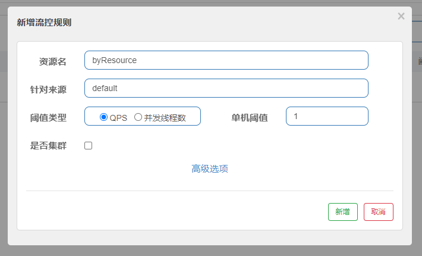
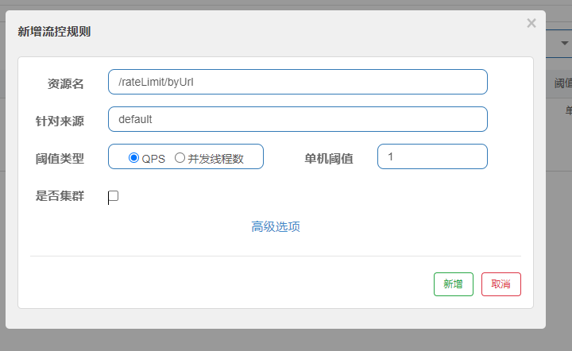
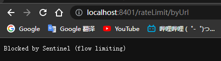

导入Commons公共模块，新写一个Controller

## 按照名称限流

```java
@RestController
public class RateLimitController {

    @GetMapping("/byResource")
    @SentinelResource(value = "byResource", blockHandler = "handleException")
    public CommonResult byResource() {
        return new CommonResult(200, "按资源名称限流", new Payment(2020L, "serial001"));
    }
    public CommonResult handleException(BlockException blockException) {
        return new CommonResult(444, blockException.getClass().getCanonicalName() + "\t 服务不可用");
    }
}
```

然后是在sentinel中新加一个流控规则



1秒钟1下，如果点快了就调用降级方法，如果没写降级方法，就是500

并且如果服务重启了，那么限流策略就会被sentinel删除【是临时的】


## 按照URL限流

```java
@GetMapping("/rateLimit/byUrl")
@SentinelResource(value = "byUrl")
public CommonResult byUrl() {
    return new CommonResult(200, "按URL限流", new Payment(2020L, "serial002"));
}
```



如果超过阈值，就是系统默认的降级，并且如果服务重启了，那么限流策略就会被sentinel删除【是临时的】




## 自定义限流

现在cloud包下新建一个myhandler

```java
public class CustomerBlockHandler {

    public static CommonResult handlerException(BlockException blockException) {
        return new CommonResult(444, "自定义全局限流1");
    }

    public static CommonResult handlerException2(BlockException blockException) {
        return new CommonResult(444, "自定义全局限流2");
    }

}
```

回到Controller，只需要配置好自定义的处理器，选好哪个方法就可以用了

```java
// ---------------------------------自定义限流------------------------------------------
@GetMapping("/rateLimit/customerBlockHandler")
@SentinelResource(value = "customerBlockHandler",
        blockHandlerClass = CustomerBlockHandler.class,
        blockHandler = "handlerException2")
public CommonResult customerBlockHandler() {
    return new CommonResult(200, "自定义限流", new Payment(2020L, "serial003"));
}
```


## 注意点

1. @SentinelResource不支持private方法